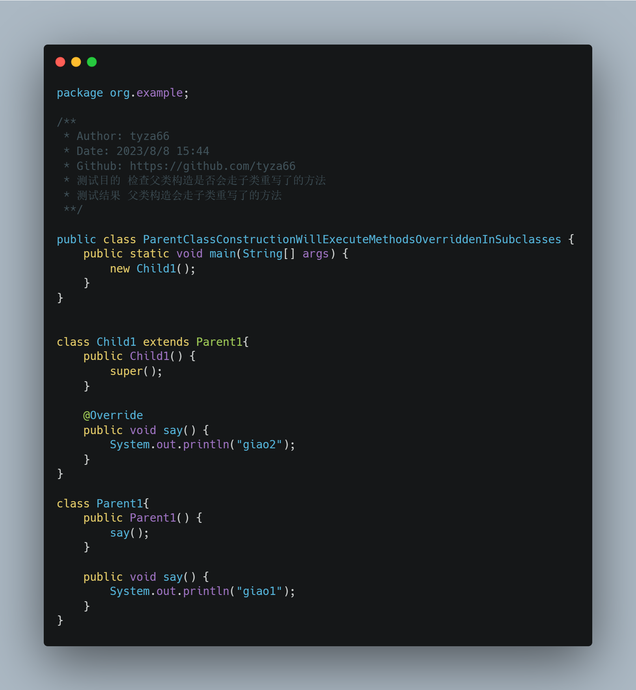
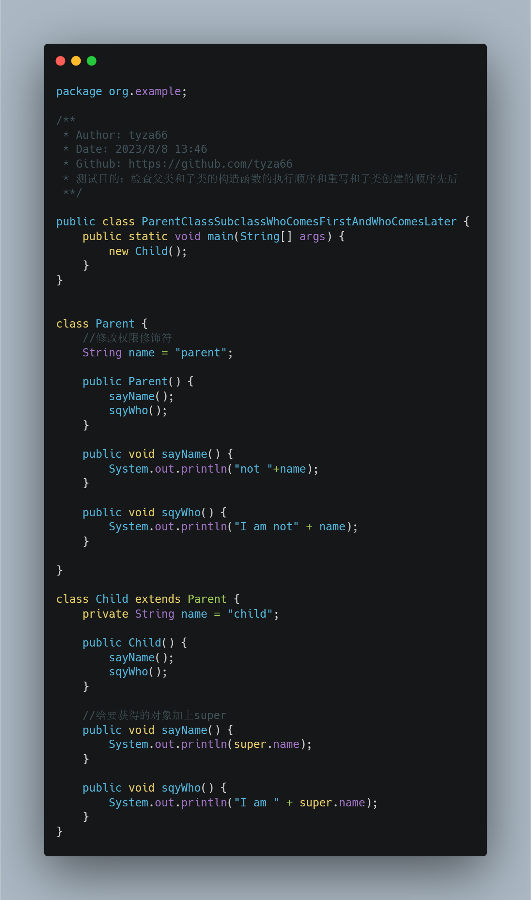
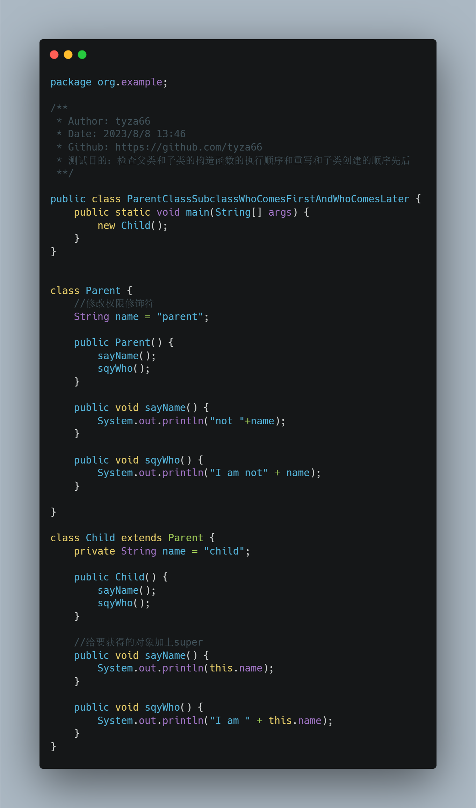
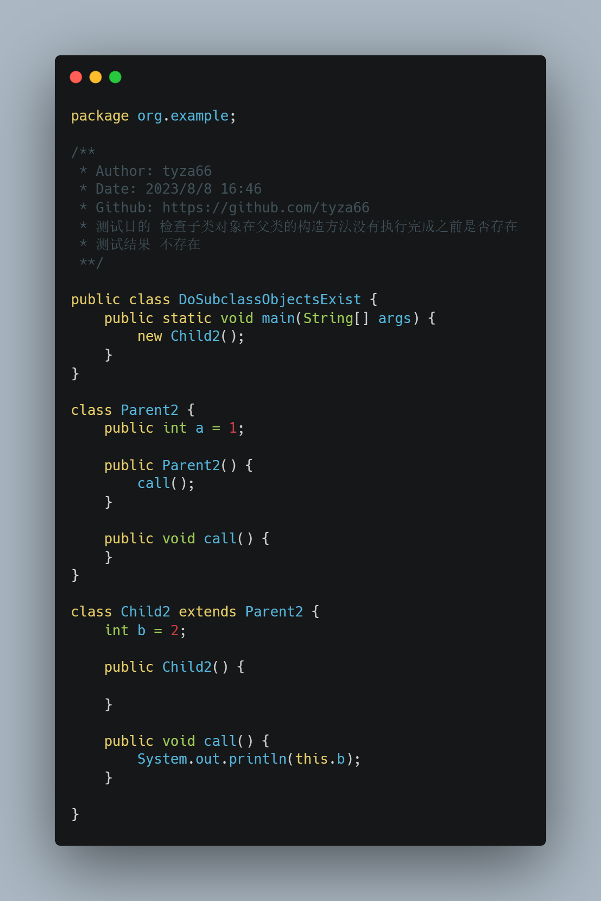
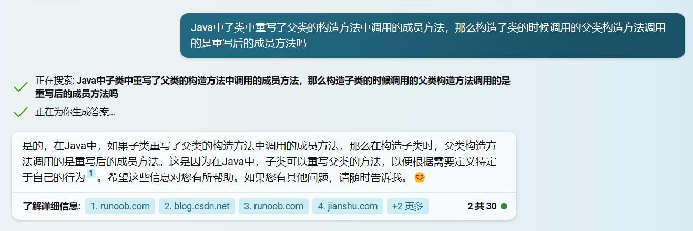
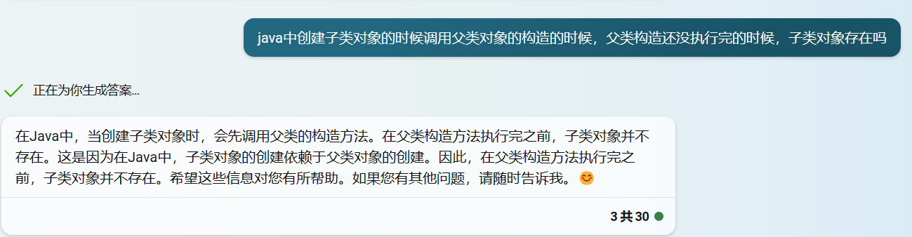

# [码上杂谈][001期]一道笔试题竟如此离谱！
### 一、起因
- 最近是实习找工作季，很多同学都在参加各种各样的面试，笔试，我的一个同学在参加某公司的笔试时，遇到了一道很有意思的题目，我也是在他的分享中看到的这道题目。
- 后来听说在这场笔试后，面试官看完答卷，就直接把答卷扔进了垃圾桶，宣布没有一个人答对。这让我感觉到了这道题目的离谱之处，所以我就想着写一篇文章来分享一下这道题目。
- 小小一道写运行结果的题目，竟能把全场面试者难住，这道题目的出题者真的是太有才了。
- 如果不仔细看的话，就会被这道题目给坑了。这道题目的题干如下。
  
### 二、题目
##### 问题
下面这段代码的输出结果是什么？
##### 代码


### 三、正确答案
##### 输出结果
```
null
I am null
child
I am child
```

### 四、提示
- 我们将这道题目的代码稍微修改一下
- 
- 这样修改以后输出结果依然不变

### 五、解析
- 如果你的结果和答案一样的话，那么恭喜你，你的Java基础已经是相当扎实的了。如果看完提示后恍然大悟或者半恍然大悟或者完全没明白的话，那么请继续往下看。
- 前两个结果竟然是null，这......有点意外。
- 其实这道题考察的知识点是继承、重写、对象创建顺序等。
- 修改了父类中的俩方法之后输出结果不变。明显的，父类中的方法根本没有执行过。
- 那么线索有了，就是方法重写。
- 我们知道，当我们执行new Child()的时候，会先执行父类的构造方法，然后再执行子类的构造方法，也就是相当于在子类构造方法的第一行有一个隐藏的super(); 这是Java对象创建的顺序。
- 在提示中，我们将子类中的两个方法输出的内容改变了，但是运行结果依旧是和原来一样，这说明父类的构造方法调用的方法其实执行的也是子类中重写过的方法，这个知识点有点隐秘，可能很多人没有注意到。
- 接下来我们来写一个小例子
- 
- 这个例子的输出结果是
    ```
    giao2
    ```
- 这个例子的意思是，父类中有一个方法，子类中也有一个方法，子类中的方法重写了父类中的方法，然后在父类的构造方法中调用了这个方法，这个时候执行的是子类中的方法，而不是父类中的方法。
- 父类的成员方法从头到尾没执行过的问题解开了，接下来我们来看一下，为什么输出的前两个值是null，后两个值是child。
- 最使我们疑惑的问题其实是：明明这个值在父类和子类中都分别定义了，并且赋初始值了，为什么还会出现null呢？
- 我们再对代码进行两次改动
- 
- 
- 在这两次改动后输出结果分别为
    ```
    //第一次输出结果
    parent
    I am parent
    parent
    I am parent
    //第二次输出结果
    null
    I am null
    child
    I am child
    ```
- 这两次改动的变化就是访问的属性不一样，我们惊奇的发现使用super修饰的属性拿到值了，而使用this修饰的属性还是null。这说明了两个情况，一个情况是默认情况下的修饰符是this，另一个情况是super里面的属性有，而this里面的属性没有。
- 那么我们再来看一下，为什么会出现这种情况呢？
- 我们知道，当我们执行new Child()的时候，会先执行父类的构造方法，然后再执行子类的构造方法，也就是相当于在子类构造方法的第一行有一个隐藏的super(); 这是Java对象创建的顺序。
- 哎？这句话刚才是不是说过了？没错，这句话是刚才说过的，但是这句话的重要性不容忽视，这句话的意思是，当我们执行new Child()的时候...
- 扪心自问，正常情况下，咱们会想到类创建顺序的问题吗，答案是肯定的，会的，我们背的都是：先执行父类构造，构造父类对象......
- 创建子类对象的时候调用父类对象的构造的时候，在父类构造还没执行完的阶段，子类对象会存在吗？答案是否定的，不会存在。我我们看下面这个例子。
- 
- 这段代码的执行结果为0，证明了子类对象在父类构造方法还没执行完的时候是不存在的。
- 因为子类对象还没创建出来，所以子类对象的属性也就不存在了，所以使用this修饰的属性是null。
- 至此，这道“简短”的面试题也就解析完了，真的是有点小复杂。

### 六、难点
- 
- 
  
### 七、看代码
- 题目代码：https://github.com/tyza66/RandomMeasurement/blob/main/Java/src/main/java/org/example/ParentClassSubclassWhoComesFirstAndWhoComesLater.java
- 验证重写执行代码：https://github.com/tyza66/RandomMeasurement/blob/main/Java/src/main/java/org/example/ParentClassConstructionWillExecuteMethodsOverriddenInSubclasses.java
- 验证实例化顺序代码：https://github.com/tyza66/RandomMeasurement/blob/main/Java/src/main/java/org/example/DoSubclassObjectsExist.java

### 八、总结
- 小题虽复杂，但也不算难，考验对知识点的掌握和看代码的深度（有时候需要多想）
- 感谢您能耐心看完这篇文章，如果有什么问题，欢迎在评论区留言，我会尽快回复。
- 如果您觉得写的还不错，欢迎关注、点赞、分享、订阅、Star，您的点赞是我写作的动力。
