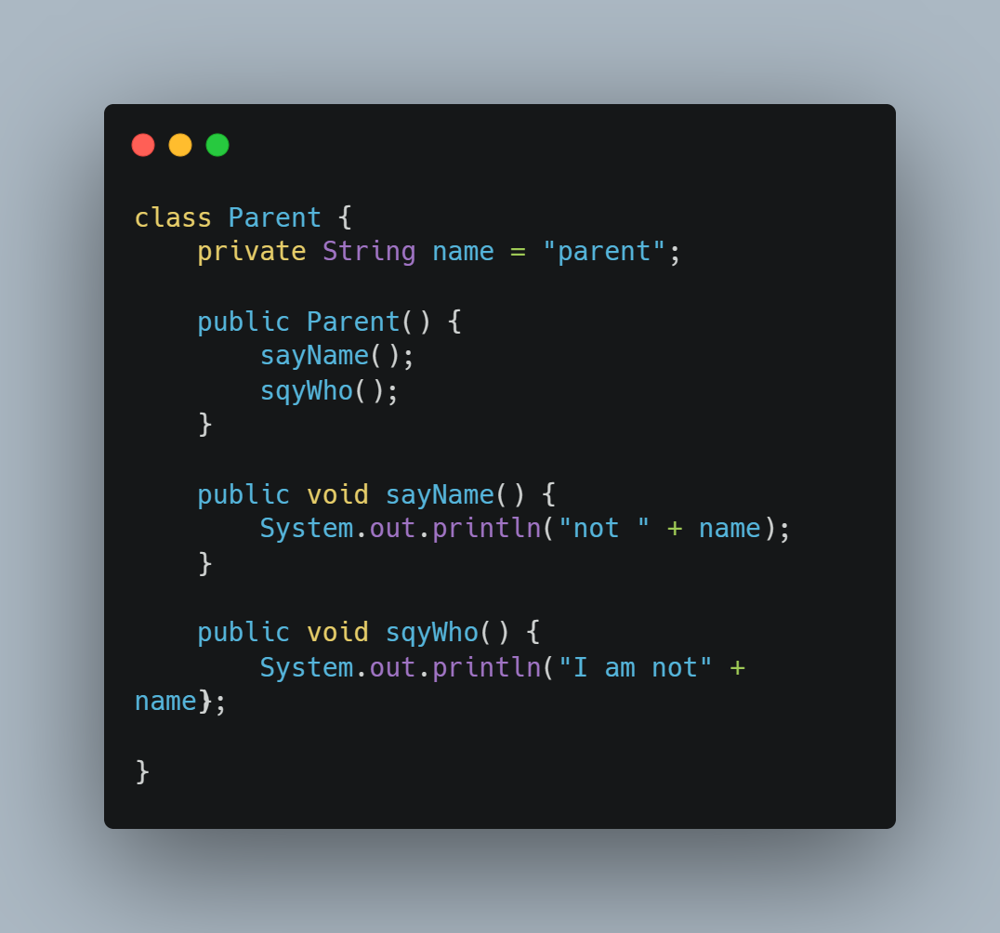

# [码上杂谈][001期]一道笔试题竟如此离谱！
### 一、起因
- 最近是实习找工作季，很多同学都在参加各种各样的面试，笔试，我的一个同学在参加某公司的笔试时，遇到了一道很有意思的题目，我也是在他的分享中看到的这道题目。
- 后来听说在这场笔试后，面试官看完答卷，就直接把答卷扔进了垃圾桶，宣布没有一个人答对。这让我感觉到了这道题目的离谱之处，所以我就想着写一篇文章来分享一下这道题目。
- 小小一道写运行结果的题目，竟能把全场面试者难住，这道题目的出题者真的是太有才了。
- 如果不仔细看的话，就会被这道题目给坑了。这道题目的题干如下。
  
### 二、题目
##### 问题
下面这段代码的输出结果是什么？
##### 代码


### 三、正确答案
##### 输出结果
```
null
I am null
child
I am child
```

### 四、提示
- 我们将这道题目的代码稍微修改一下
- 
- 这样修改以后输出结果依然不变

### 五、解析
- 如果你的结果和答案一样的话，那么恭喜你，你的Java基础已经是相当扎实的了。如果看完提示后恍然大悟或者半恍然大悟或者完全没明白的话，那么请继续往下看。
- 前两个结果竟然是null，这......有点意外。
- 其实这道题考察的知识点是继承、重写、对象创建顺序等。
- 修改了父类中的俩方法之后输出结果不变。明显的，这说明走的都是子类中重写的方法。
- 

